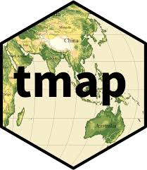

```{r setup, include=FALSE}
knitr::opts_chunk$set(echo = TRUE)
```

<a href="https://github.com/Smithsonian/IntroductionToGIS.git" class="github-corner" aria-label="View source on GitHub"><svg width="80" height="80" viewBox="0 0 250 250" style="fill:#151513; color:#fff; position: absolute; top: 0; border: 0; right: 0;" aria-hidden="true"><path d="M0,0 L115,115 L130,115 L142,142 L250,250 L250,0 Z"></path><path d="M128.3,109.0 C113.8,99.7 119.0,89.6 119.0,89.6 C122.0,82.7 120.5,78.6 120.5,78.6 C119.2,72.0 123.4,76.3 123.4,76.3 C127.3,80.9 125.5,87.3 125.5,87.3 C122.9,97.6 130.6,101.9 134.4,103.2" fill="currentColor" style="transform-origin: 130px 106px;" class="octo-arm"></path><path d="M115.0,115.0 C114.9,115.1 118.7,116.5 119.8,115.4 L133.7,101.6 C136.9,99.2 139.9,98.4 142.2,98.6 C133.8,88.0 127.5,74.4 143.8,58.0 C148.5,53.4 154.0,51.2 159.7,51.0 C160.3,49.4 163.2,43.6 171.4,40.1 C171.4,40.1 176.1,42.5 178.8,56.2 C183.1,58.6 187.2,61.8 190.9,65.4 C194.5,69.0 197.7,73.2 200.1,77.6 C213.8,80.2 216.3,84.9 216.3,84.9 C212.7,93.1 206.9,96.0 205.4,96.6 C205.1,102.4 203.0,107.8 198.3,112.5 C181.9,128.9 168.3,122.5 157.7,114.1 C157.9,116.9 156.7,120.9 152.7,124.9 L141.0,136.5 C139.8,137.7 141.6,141.9 141.8,141.8 Z" fill="currentColor" class="octo-body"></path></svg></a><style>.github-corner:hover .octo-arm{animation:octocat-wave 560ms ease-in-out}@keyframes octocat-wave{0%,100%{transform:rotate(0)}20%,60%{transform:rotate(-25deg)}40%,80%{transform:rotate(10deg)}}@media (max-width:500px){.github-corner:hover .octo-arm{animation:none}.github-corner .octo-arm{animation:octocat-wave 560ms ease-in-out}}</style>

# Learning Objectives

* Create and import spatial data in R
* Understand basic raster and vector analysis functions
* Set and/or reproject various spatial data layers
* Extract environmental values for spatial points and regions
* Use R to create maps and visualize spatial data in `tmap`

# Introduction to GIS

Many of you are familiar with Geographic Information Systems (GIS) and have used a variety of software programs (i.e., ArcGIS, QGIS) to visualize spatial data and perform spatial analyses.  We will demonstrate how to use R exclusively as a GIS.  

We will make use of 7 packages in this lesson (`sf`, `terra`, `dplyr`, `tidyverse`, `lubridate`, `gt`, and `tmap`).  Make sure each of these packages are first installed on your computer before activating the library (e.g., `install.packages(c('sf', 'terra', 'tidyverse', 'lubridate', 'gt', 'tmap'))`).  Remember, packages only need to be installed once.  Afterwards, you just need to initialize them at the start of you code.  

For this exercise, please create an script called `IntroToGIS.R` and save it in the `Scripts` folder.

```{r, warning=F, message=F}
# Load libraries
library(sf)
library(terra)
library(dplyr)
library(tidyverse)
library(lubridate)
library(gt)
library(tmap)
```

# Vector Data

Vector data are composed of points, lines, and polygons.

* **Points** are the simplest spatial object. Each point consists of a coordinate pair (X, Y) that is structured as a two-column matrix (e.g., latitude, longitude). Each point can also have associated variables as attribute information. For instance, species occurrence data often have information on elevation, date, and habitat at each point recorded in the field, in addition to their X and Y coordinate. In such cases, the data will be a dataframe containing several columns, each corresponding to a different variable (e.g. Point ID, X coordinate, Y coordinate, elevation, date recorded, habitat type).  Each row corresponds to a single point.

```{r}
plot(st_point(c(0,0)))
plot(st_point(c(0.5,0.5)), add = T)
```

* **Lines** (or **polylines**) are used to represent linear features such as roads, rivers, and trails. A single line is composed of an ordered set of points (2D coordinates) that are connected by line segments, which allows us to calculate length/distance.

```{r}
# Generate a random linestring...6 numbers across 2 columns
plot(st_linestring(matrix(runif(6), ncol=2)) )
```

* **Polygons** are used to represent the extent of geographic features, such as a city boundary, the boundary of a body of water, sampling plots, and habitat patches. Polygons are composed of several lines that close into a polygon, allowing us to calculate area and perimeter.

```{r}
plot(st_polygon(list(rbind(c(0,0), c(1,0), c(1,1), c(0,1), c(0,0)))))
```

## Coordinate Systems and Projections

Spatial data collected using GPS devices or downloaded online must have a projection system that links the coordinates to specific locations on the earth’s surface. Without a coordinate reference system, there is no way to locate places to their location on Earth.    

Any geospatial data (e.g., a set of points) with an incorrect projection or with unknown projection system can be visualized on its own. However, you will not be able to plot that data with other spatial data, as the coordinate reference system is missing. Importantly, you will not be able to conduct any spatial analysis (e.g., calculate the distance of a given point to a road, or extract the value of the underlining raster value at the point locations), since the incorrectly projected (or unprojected) spatial data is pointing to a completely different location on earth than intended.

Spatial data without the correct projection system is basically useless. When you acquire or download geospatial data, make sure you know the projection of the data.  This information is usually found in the metadata of a given dataset or should be provided by the person that is sharing the data with you.

There are EPSG Codes that can be used to avoid manually setting all the parameters needed in a projection. For instance, the code EPSG:32637 references the UTM37N projection with WGS84 datum and ellipsoid. The code EPSG:32736 references UTM36S.  You can find the EPSG reference listed in http://spatialreference.org/ref/epsg/ and https://epsg.io/.

<center>
{width=75%}
</center>
<br>

It is important to understand that projections try to minimize distortion of a 3-dimensional object (the earth) on a 2-dimensional surface (paper map or computer screen). Choosing a projection that minimizes this distortion is expecially important when doing calculations of area or speed. I recommend collecting all GPS data in geographic coordinates and projecting data into a coordinate system that minimizes distortion of your objects of interest.  

The Universal Tranverse Mercator (UTM) projection is a common projection used for assigning coordinates to locations on the surface of the earth.  The UTM projection divides earth into 60 distinct zones, using the equator as the origin (0) and spanning 1,000,000 meters.  The center of the zone is defined as 500,000 meters.  As a result, you can identify any geographic point on earth to a specific UTM zone and meter coordinate.

<center>
](hUKSY.jpg){width=75%}
</center>
<br>

Identifying the correct UTM zones is relatively simple, with multiple options:

  1. Mathematical Approach
      + Take a longitudinal coordinate (or calculate the mean value) from your dataset and add 180.  Then divide by 6 and round up to the nearest whole number.
      + Example: -39 + 180 = 141 / 6 = 23.5 == 24
      + 39$^\circ$W is UTM zone 24.  Then simply determine if the point is above (N) or below (S) the equator.
  
  2. Check the PRJ File
      + Check the .prj file with an associated shapefile of your study area.   

  3. Download the World UTM Grid
      + ArcGIS (or similar GIS software) include downloadable [UTM Zones](https://hub.arcgis.com/datasets/esri::world-utm-grid/explore) data layers.  Loading this file with your point dataset will show you where your data overlap.  I have placed a `utmzone.shp` file in the `Data` folder.

  4. Check the Zone Number in Google Earth
      + Convert your dataset to a KMZ/KML file and load into Google Earth.  Be sure your units are set to UTMs in Google Earth.  The zone number will appear at the bottom center of your screen when you zoom into your file.
  
**Note**: Sometimes data spans multiple UTM zones (e.g., UTM 36 south and UTM 37 south).  This isn't too big an issue if you are analyzing data at the edges of the UTM zones.  Some coordinate systems (e.g., Lambert’s or Alber’s Equal-Area conic projections), however, are designed for this type of issue, with an aim to minimize distortion when analyzing data across large spatial extents.

## R Packages for Vector Data

There are two main packages in R to handle geospatial vector data: the `sp` package and the `sf` package.

The first package to provide classes and methods for spatial data types in R is called `sp`. Development of the `sp` package began in the early 2000s in an attempt to standardize how spatial data would be treated in R and to allow for better interoperability between different analysis packages that use spatial data. The package (first release on CRAN in 2005) provides classes and methods to create points, lines, polygons, and grids, with functions work with them.  About 350 packages developed for spatial analysis use the data types implemented in `sp`, which means several spatial packages “depend” on the `sp` package in some way.

The `sp` package depends on `rgeos` and `rgdal`. However at the end of 2023, these packages were retired, primarily because their maintainer, Roger Bivand, has retired. You can read more about it [here](https://r-spatial.org/r/2022/04/12/evolution.html).

All geospatial work in R is being replaced by the more modern package `sf`. `sf` was first released on CRAN in late October 2016. It implements a formal standard called “Simple Features” that specifies a storage and access model of spatial geometries (i.e. points, lines, polygons).  `sf` provides fast I/O, particularly relevant for large files.

## The `sf` Package

The `sf` class is an extension of a dataframes. Essentially, `sf` objects can be treated as dataframes that also contain spatial data, as opposed to spatial data that may or may not also contain data frames. This enables `sf` objects to fit within the `tidyverse` workflow, making it possible to manipulate them with the `dplyr` commands we used previously.

`sf` objects consist of rows of features, hence the name “simple features (`sf`)”, which have both non-spatial and spatial data formats.  The spatial data of an `sf` object is contained in a special geometry column that is of class ‘sfc - simple features class’. The geometry column contains the basic types of spatial data: the Coordinate Reference System (CRS), coordinates, and type of geometric object.

The ‘sfc’ class has seven subclasses to denote the types of geometric objects within the geometry column, which are derived from the simple features standard. The possible geometric objects are point, linestring, polygon, multipoint, multilinestring, multipolygon, and geometrycollection, which is used for any combination of the other types.

](AllisonHorst_sf.png)
<br>

## Convert a Dataframe to a `sf` Object

In your research, you may create spreadsheets that contain data associated with spatial coordinates. You already know how to read the spreadsheet into a R with `read.table()` or `read.csv()`. We can very easily convert data with coordinates into a spatial object in R.

Lets start converting a data frame into a `sf` object. For this, our dataframe needs to have at least two columns indicating the coordinates of points. This could, for example, be the location of an animal observation recorded in the field.

We will then use the function `st_as_sf()` that requires a vector of coordinates to be input to the ‘coords’ argument, and an EPSG code or a PROJ definition for the crs. We can import the file just like any other data file and then make the data file a `sf` object.  As an example, we will use a datafile of the major towns throughout Kenya.

```{r}
# Import Kenya Major Towns CSV File.  Just a flat dataframe (non-spatial)
my_df <- read.csv("Data/ke_major-towns.csv", header = TRUE)
head(my_df)

# Create sf object with geo_data data frame and CRS.  I.e., Make the data spatial.
points_sf <- st_as_sf(my_df, coords = c("lon", "lat"), crs = 4326)
print(points_sf)
#plot(points_sf, pch = 18, cex=1)
```

## Setting or Projecting an `sf` Object

If you need to assign a CRS to an `sf` object, you can use the function `st_set_crs()`.  To reproject an `sf` object, you can use the function `st_transform()`. You need to provide the object and the new CRS.  Here, we will project the `points_sf` spatial object from decimal degrees, WGS84 (crs = 4326) to UTM37N, WGS84 (crs = 32637). 

**Note**: There is an important distinction between 'Setting a projection' and 'Re-projecting an object' to a new projection.  Only use `st_transform()` to project or transform your object from a known coordinate system or projection to another (e.g., Geographic coordinates to UTM projection). `sf::st_crs()` should only be used to retrieve or set your existing coordinate reference system.  Using `st::st_crs()` to erroneously re-project your data would be akin to setting a new home address without actually moving to this new location. 

```{r, warning=F, message=F}
points_sf_UTM <- st_transform(points_sf, crs="+proj=utm +zone=37 +north +ellps=WGS84 +datum=WGS84 +units=m")
points_sf_UTM
```

## Reading Shapefiles into R

Reading shapefiles into R using the `sf` package is straightforward. We use the function `st_read()` and can print a summary of the file to check that the projection is what we expect it to be.

```{r, warning=F, message=F}
ke_mammals <- st_read("Data/ke_mammals_WGS84.shp")
ke_mammals
```

**Questions**:

1. What is the file type of the vector layer 'ke_mammals'?
2. What function would we use if we wanted to change the projection of this vector file?

## `sf` Object Manipulation

All `sf` objects can generally be treated as dataframes when wrangling the data. This makes it possible to use workflows that we are already familiar with.  For instance, we can use the function `filter()` to return a subset of mammals in the file.  As a demonstration, let's filter this messy dataset to only view the polygons that contain more than 60 species of mammals.

```{r, warning=F, message=F}
# Look at the data
plot(ke_mammals)

# Create a dataset subset of the polygons with > 60 mammals
mammals_60 <- ke_mammals %>% 
  rename_with(tolower) %>% # This function renames all column headers...in this case to lowercase
  filter(mammals > 60)

# Print
#nrow(mammals_60)
mammals_60
```

**Questions**:

1. What function would you use to look at the first few rows of 'mammals_60'?  What about the structure of the object?
2. How would you plot the result of your query?

```{r, warning=F, message=F, echo=F, eval=F}
# Look at the head and structure
head(mammals_60)
str(mammals_60)

# Plot the result
plot(mammals_60)
```

# Raster Data

While this class is not designed to explore the many concepts of remote sensing, you should be aware that the electromagnetic spectrum consists of a range of frequencies, wavelengths, and photon energies.  With our own eyes, we are only able to see a very small portion of spectrum, referred to as visible light.  But, we can use specialized sensors to collect information across the entire electromagnetic spectrum and visualize the resulting information in colors that we can make sense of. We will do so below after loading a [Landsat 8](https://www.usgs.gov/landsat-missions/landsat-8) satellite image collected on 22 February 2024 across southern Kenya (Path 169, Row 061).

<center>
](electromagnetic-waves.png)
</center>
<br>

Raster processing is an important aspect of building spatial datasets for analysis. Doing so within R can greatly streamline workflows, allowing for analyses to be completed in a single analysis program. Here, we will walk through a series of steps to provide the basic skills necessary for image analysis.

<div style="float:right">

</div>

Rasters are composed of pixels or cells. Each raster contains a CRS, the coordinates of its origin, dimensions, and an array of cell values.  The `raster` package has been the main package to work with raster data in R historically. However, in 2020 the package `terra` was released.  Thanks to its greater functionality and efficiency, `terra` has now replaced the `raster` package.  We will be using `terra` in all of our exercises.

Before we start processing the [Landsat 8](https://www.usgs.gov/landsat-missions/landsat-8) satellite image, we need to recognize that the image consists of the following spectral bands:

Band |	Wavelength |	Useful for mapping
---- | ----------- | ------------------
Band 1 | Coastal Aerosol	0.43 - 0.45 |	Coastal and aerosol studies
Band 2 | Blue	0.45 - 0.51	| Bathymetric mapping, distinguishing soil from vegetation, and deciduous from coniferous vegetation
Band 3 | Green	0.53 - 0.59	| Emphasizes peak vegetation, which is useful for assessing plant vigor
Band 4 | Red	0.64 - 0.67	| Discriminates vegetation slopes
Band 5 | Near Infrared (NIR)	0.85 - 0.88 |	Emphasizes biomass content and shorelines
Band 6 | Short-wave Infrared (SWIR) 1	1.57 - 1.65	| Discriminates moisture content of soil and vegetation; penetrates thin clouds
Band 7 | Short-wave Infrared (SWIR) 2  	2.11 - 2.29	| Improved moisture content of soil and vegetation and thin cloud penetration
Band 8 | Panchromatic	0.50 - 0.68	| 15 meter resolution, sharper image definition
Band 9 | Cirrus	1.36 - 1.38	| Improved detection of cirrus cloud contamination
Band 10 | TIRS 1	10.60 - 11.19	| 100 meter resolution, thermal mapping and estimated soil moisture
Band 11 | TIRS 2	11.50 - 12.51	| 100 meter resolution, Improved thermal mapping and estimated soil moisture

## Loading Rasters

To load/read a raster image into R, we will use the function `rast()`.  Similar to other actions, we need to tell the function where our image is located.  

**Note**: Only Bands 1-7 have been included in the raster stack (i.e., Bands 8-11 have been excluded).

```{r, warning=F, message=F}
# Read the image
Image <- rast("Data/Landsat8.tif")
Image
```

**Questions**:

1. What is the spatial resolution of this image?  
2. What is the CRS?
3. How many bands are included in the raster stack?

## Querying an Image

Similar to dataframes that we are growing comfortable with, we can query the image object to obtain information about its contents. 

```{r, warning=F, message=F}
# Summarize the object
print(Image)

# What is the class of the object?
class(Image)

# Summarize the bands included in the stack
names(Image)

# Provide summary statistics of each band
summary(Image)

# What is the extent of the image?
ext(Image)
```

## Setting or Projecting a Raster Image

Similar to operations with `sf` objects, we can get, set, and re-project raster images.  Unlike `sf`, the command to reproject a raster is called `project()` instead of `st_transform()`.  

**Note**: When you reproject a raster, the pixels will shift slightly, especially if you are changing the resolution of the image (e.g., from 30-m to 100-m).  See the `help` commands for the function `project()` which provide information on the resampling method to use.  In general, you should choose bilinear or cubic interpolation for continuous data and nearest neighbor for categorical data (e.g., land-cover classifications).

```{r, message=F, warning=F}
# Obtain the Coordinate Reference System of the image
crs(Image, proj=T)

# If the projection of the image was null, we'd have to set it
#crs(Image) <- "+proj=utm +zone=37 +datum=WGS84 +units=m +no_defs"

# To Reproject an image, we'd do the following:
# Imagelatlong <- project(Image, "+init=epsg:4326", method = 'bilinear')
# crs(Imagelatlong, proj = T)
```

## Image Plotting

Raster images can be plotted and/or visualized using a number of commands.  Two helpful plotting functions include the basic `plot()` function and a `plotRGB()` function for plotting a 3-band image.  

```{r}
# Plot an image.  Here, I am only plotting band 4.
plot(Image, 4)

# Or, use plotRGB to plot a 3-band image
plotRGB(Image, r=4, g=3, b=2, stretch="lin", axes=T, xlab="Easting", ylab="Northing", main="Landsdat 8, Bands 4,3,2 (RGB) - True Color Composite")
```

**Question:**:

1. Create a false color image, displaying bands 5,4,3 in RGB. 

```{r, warning=F, message=F, echo=F, eval=F}
# Plot a 3-band RGB image in false color composite
plotRGB(Image, r=5, g=4, b=3, stretch = "lin", axes=TRUE, xlab="Easting", ylab="Northing", main="Landsat 8, Bands 5,4,3 (RGB) - False Color Composite")
```

## Raster Calculations

The real strength of the `terra` package is the ability to perform complex mathematical operations on an images pixels.  One of the most commonly used raster products, at least in terrestrial ecology, is the Normalized Difference Vegetation Index (NDVI).  NDVI is calculated from a ratio of the red and near-infrared spectral bands.  The index is a measure of greenness (i.e., the density of live green vegetation)

NDVI values are within a range of -1 to 1.  Negative NDVI values (values approaching -1) correspond to water. Values close to zero (-0.1 to 0.1) generally correspond to barren areas of rock, sand, or snow. Low, positive values represent shrub and grassland (approximately 0.2 to 0.4), while high values (values approaching 1) indicate dense vegetation.

To calculate NDVI, we can do a simple math calculation to manipulate the raster data layers. NDVI is:

$$NDVI = \frac{(NIR - red)}{(NIR + red)}$$

where red and NIR stand for the spectral reflectance measurements acquired in the red (visible) and near-infrared (NIR) regions of the electromagnetic spectrum.

```{r, warning=F, message=F}
# Using standard math operators, rename the red band (band 3) and the near-infrared band (band 4) in the image.
redBand <- Image$B4
nirBand <- Image$B5

# Create NDVI
ndvi <- (nirBand-redBand)/(nirBand+redBand)

# Rename the bank
names(ndvi) <- "NDVI"

# Plot the image
plot(ndvi)

# Display a histogram of values
hist(ndvi)
```

## Pixel Extraction

We are often most interested in linking our points, lines, or polygons with remote sensing data.  This forms the basis for more complex analyses, such as answering questions about 'why' and animal is located in one place rather than another.  To do so, we first need to make sure our spatial information is in the same projection.  We can then use the function `extract()` to add the remote sensing data to our points, lines, or polygons.  

In this example, we will create a few random points using the function `st_sample()`.  We'll create these points within the bounding box (`st_bbox()`) of our satellite imagery.  We'll then plot these data and extract the pixel values at each point.

```{r, warning=F, message=F}
# Create random samples (pixels) from a raster
ranSamps <- st_sample(st_as_sfc(st_bbox(ndvi)), size = 10, type = "random") # This step is skipped if you have a file that overlaps with your raster
# Convert to a simple feature
ranSamps <- st_as_sf(ranSamps) # Note that I have overwritten the initial object
# Print
ranSamps

# Plot the random points on top of our NDVI image
plot(ndvi)
plot(ranSamps, add=T)

# Now Extract
ndvi.vals <- terra::extract(ndvi, ranSamps)  # We need to be explicit that extract comes from the terra package here
ndvi.vals
```

## Writing an Image

Wed can also save rasters to your hard drive so that the file can be read into other programs (e.g., ArcGIS, QGIS). See the help file for the function `writeRaster()`.

**Question**:

1. Write the ndvi file we created above to your 'Output' directory as a .tif.  Call this file 'NDVI.tif'.

```{r, warning=F,message=F, echo=F, eval=F}
writeRaster(ndvi, "Output/NDVI.tif", overwrite=TRUE)
```

# Spatial Operations

Now that we know how to load vector and raster data, we'll conduct some simple analyses on data layers loaded into R.  This will include layers collected by the Mara Elephant Project (Tyrell et al. 2022).  We will be using tools and functions that are commonly used in GIS software programs, such as `buffer` and `reselect`.  The only difference is that we will be coding these functions manually in R, rather than using the Graphical User Interace (GUI) common to ArcGIS or QGIS. 

The LandDx dataset can be referenced as:

Tyrrell P., Amoke I., Betjes K., et al. 2022. Landscape Dynamics (landDX) an open-access spatial-temporal database for the Kenya-Tanzania borderlands. Scientific Data 9 (8). [doi.org/10.1038/s41597-021-01100-9](https://www.nature.com/articles/s41597-021-01100-9)

## Load Spatial Data

First, let's make sure all of our data layers are loaded into R and that they are all projected to the same coordinate system.  I have simplified the code here after investigating the projection of each individual file.  We'll use `select()` to simplify the number of columns included in each dataset and use piping commands (`%>%`) to make our code as parsimonious as possible. 

```{r, warning=F, message=F}
# Load Fence data layer - Data layer is Geographic 
Fences <- st_read("Data/Fences_LandDx.shp") %>%
  select(type, active) %>% # Select the type of fence and whether it is active
  st_transform(crs = 32736) # Transform to UTM 36S WGS84

# Read in the Conservancy data layer - Data layer is projected to UTM36S
Mara_Cons <-  st_read("Data/MaraConservancies.shp") %>% 
  select(objectid, short_name, Shape_Leng, Shape_Area) # Columns to select
  
# Read in the primary roads data layer - Data layer is Geographic 
Roads <- st_read("Data/PrimaryRoads.shp") %>% 
  select(type, name, active) %>% # Columns to select
  st_transform(crs = 32736) # Transform to UTM 36S WGS

# Read in the bomas data layer - Data layer is Geographic 
Bomas <- st_read("Data/bomas_LandDx.shp") %>% 
  select(short_name) %>% # Columns to select
  st_transform(crs = 32736) # Transform to UTM 36S WGS84

# Read in the towns data layer - Data layer is Geographic
Towns <- st_read("Data/MajorTowns.shp") %>% 
  st_transform(crs = 32736) # Transform to UTM 36S WGS84

# Read in the Reserve boundary - Data layer is projected to UTM36S
MMNR <- st_read("Data/MMNR.shp") %>% 
    select(NAME)
```

## Check Data Display

We should always check to make sure our data layers are displaying in their correct geographic location.  We will use the basic plotting commands here and the function `st_geometry()` to display the geographic features of each dataset.  We'll add coordinates to the plot by using the argument `axes = TRUE` and include the argument `add = TRUE` to overlap layers on top of each other. 

While not the prettiest map, the result has the desired effect of providing a quick look at the data and convincing us that we are ready for more complex analyses.  Explore the package `ggplot()` for improved plotting options.  

```{r, warning=F, message=F}
# Create a quick plot of some of the data layers loaded.
# Do they overlap?
par(mfrow = c(1,2))
plot(st_geometry(Mara_Cons), border = 'dark green', col = 'light green', xlab = 'Easting', ylab = 'Northing', axes = TRUE)
plot(st_geometry(Fences), col = 'blue', add = TRUE) # Fences are a line file...we must use 'col' to color the lines
plot(st_geometry(Towns), col = 'red', cex = 0.5, pch = 17, add=TRUE)

plot(st_geometry(Mara_Cons), border = 'dark green', col = 'light green', xlab = 'Easting', ylab = 'Northing', axes = TRUE)
plot(st_geometry(MMNR), col = 'light green', border = 'dark green', add=TRUE) # MMNR is a polygon
plot(st_geometry(Towns), col = 'red', cex = 0.5, pch = 17, add=TRUE)
plot(st_geometry(Roads), col = 'black', add=TRUE)
par(mfrow = c(1,1))
```

## Reselect

Similar to operations with dataframes, we can use `filter()` to select attributes from `sf` objects.  As an example, let's select 'Naboisho' from the `Mara_Cons` file.  This file will keep it's spatial properties and allow us to display it individually.  We can also query individual attributes, such as conservancies that are larger than a certain area.  

Similar to ArcGIS or QGIS, the values calculated as attributes in the dataframe, such as the area or perimeter of each polygon, are static measures.  We should recalculate these values prior to selection the attribute.  Here, we'll recalculate the area of each polygon, convert it to acres, and then select only those conservancies that are > 50,000 acres.

```{r, message=F,warning=F}
# Complete a simple filter
Nab_Cons <- Mara_Cons %>% 
  filter(short_name == "Naboisho Conservancy")
Nab_Cons
#plot(Nab_Cons)

# Now, recalculate the area of all the conservancies in acres and select only those conservancies that are larger than 50,000 acres.  How many are there?
Big_Cons <- Mara_Cons %>% 
  mutate(acres = units::set_units(st_area(Mara_Cons),
                                  "acre")) %>% 
  filter(as.numeric(acres) > 50000)

# How many?
length(unique(Big_Cons$short_name))
# What are there names?
unique(Big_Cons$short_name)

# We could plot them if we wanted to
# plot(st_geometry(Mara_Cons), axes=T)
# plot(st_geometry(Big_Cons), col = 'green', add=T)
```

## Distance

Lastly, we could do much more complicated analyses, like what is the average distance between bomas and roads in our dataset.  To do so, we need to convert our roads layer (vector) into a raster object using the function `rasterize()`.  We can then calculate a distance raster, extract the values at each boma location, and summarize.

```{r,warning=F,message=F}
# Create a blank raster.  Set the conservancy boundary as the extent.
canvas <- rast(ext(Mara_Cons), crs=crs(Roads), resolution=50)

# Create a road raster by rasterizing the road vector layer.
road.raster <- rasterize(Roads, canvas) 

# Generate a distance raster
distance <- distance(road.raster)

# Plot the result
plot(distance) # Result is in meters
plot(Roads, add=TRUE)
plot(Bomas, add=TRUE, pch = 15, cex = 1, col = "red")

# Extract distance
dist.extract <- terra::extract(distance, Bomas)

# Summarize findings
summary(dist.extract$layer)
hist(dist.extract$layer)

# Or we could bind the distance layer back together with or Boma layer
#Bomas.dist <- cbind(Bomas, dist.extract)
```

# Making a Map

R offers a number of options to create high quality maps for publication. This saves you from having to export all files to make final maps in other software programs. Here, we will learn the basics to make a map using the `tmap` package.  `Tmap` is a powerful and flexible package with a concise syntax. It also has the unique capability of generating static or interactive maps using the same code via the function `tmap_mode()`.  As a first step, let's load a GPS point dataset of the movements of white-bearded wildebeest (*Connochaetes taurinus*), collected from 2010-2013 (Stabach et al. 2020; 2022).  We will overlay these wildebeest on top of the map we create.

The wildebeest dataset can be referenced as:

Stabach JA, Hughey LF, Crego RD, Fleming CH, Hopcraft JGC, Leimgruber P, Morrison TA, Ogutu JO, Reid RS, Worden JS, Boone RB. 2022. Increasing anthropogenic disturbance restricts wildebeest movement across East African grazing systems. Frontiers in Ecology and Evolution. [doi.org/10.3389/fevo.2022.846171](https://doi.org/10.3389/fevo.2022.846171)

Stabach JA, Hughey LF, Reid RS, Worden JS, Leimgruber P, Boone RB. 2020. Data from: Comparison of movement strategies of three populations of white-bearded wildebeest. Movebank Data Repository. [doi:10.5441/001/1.h0t27719](https://www.datarepository.movebank.org/handle/10255/move.1095)

## Load the Wildebeest Dataset

The wildebeest dataset has been saved as a `.csv` file and requires a few extra steps to prepare it for visualization.  This includes converting the points to lines and updating the timestamp to local time.  This requires us to use some new functions that we have yet to utilize.  We'll also make a nicely formatted summary table using the `gt` package that can be easily shared with any of your colleagues or supervisors.

```{r, warning=F,message=F}
# Read in the dataset
WB <- read.csv(file = "Data/wild_mara.csv", header = TRUE)

# Create character objects for the TimeZone
Timezone1 <- 'UTC'
Timezone2 <- "Africa/Nairobi"

# We'll overwrite the dataset, clean-up the columns, and make sure no duplicate positions exist 
WB <- WB %>%
  # Rename columns and create timestamp - UTC to local
  mutate(id = ID,
         animal_id = Name,
         deploy_id = paste(id,'-',animal_id), # Join these character fields together.
         latitude = Lat,
         longitude = Long,
         sex = Sex,
         age = Age,
         species = "White-bearded Wildebeest",
         DOP = DOP,
         fixType = substr(Nav,1,2),
         timestamp = dmy_hms(paste(date, time), tz=Timezone1), # Convert to date/time
         timestamp = with_tz(timestamp, tz=Timezone2),
         .keep = "none") %>% # This last command states to only keep the columns that I specifically create here.  Ignore all remainder columns.
  
  # Remove any records where the id and timestamp are duplicated
  distinct(animal_id, timestamp, .keep_all = TRUE) %>% 
  
  # Remove any records that don't have a timestamp or a Lat/Long location
  filter(!is.na(timestamp),
         !is.na(latitude),
         !is.na(longitude),
         latitude != 0, 
         longitude != 0) %>% 
  
  # Arrange the dataset by id and timestamp
  arrange(id, timestamp)

# Visualize the first 5 rows of the dataset
head(WB)
```

### Summarize

Now we'll summarizey all data collected, inclusive of the start and end date that each animal was monitored.  This file is not spatial yet, however, even though it does have spatial coordinates.  Using functions we have already discussed, let's summarize the dataset.

```{r, warning=F, message=F}
# Summarize results to a table
wb.Summary <- WB %>% 

  # Summarize the dataset to highlight the number of records and duration of tracking period
  summarise(
    Sex = unique(sex),
    Records = n(),
    StartDate = min(timestamp),
    EndDate = max(timestamp),
    TrackPeriod = round(difftime(max(timestamp),min(timestamp),units = "days"),digits=1),
    .by = id) %>% 
  
  # Arrange by start date
  arrange(id, StartDate)

# Print the file
#wb.Summary

# We could write this file to a csv, but let's make a more attractive table
#write.csv(wb.Summary,file = "Output/wbSummary.csv", quote=FALSE, row.names=FALSE)

# Create a gt formatted table
gt_wb <- wb.Summary %>% 
  # initialize gt
  gt() %>% 
  # row striping
  opt_row_striping() %>% 
  # Add title and header
  tab_header(
    title = "Wildebeest: Tracking Data Summary",
    subtitle = Sys.Date()) %>% 
  # Easy formatting
  fmt_date(
    columns = c(StartDate, EndDate),
    date_style = 8) %>% 
  cols_label(id = "Wildebeest ID",
             Sex = "Sex",
             Records = "Total points",
             StartDate = "First location",
             EndDate = "Last location",
             TrackPeriod = "Tracking period (d)") %>% 
  # center columns
  cols_align(align = "center")

gt_wb

# Save the table as an html file to your Output folder
gtsave(gt_wb, filename = "Output/Summary_wildebeest.html")
```

### Make it Spatial

Lastly, we will convert the dataframe to a spatial object using the `st_as_sf()` function.  We'll then convert the spatial points to spatial lines (more accurately, a "LINESTRING").  We'll use a few functions that we have yet to see and will use the `summarise` function to create an individual line (`do_union=FALSE`) for each animal we monitored with a tracking device.

```{r, warning=F, message=F}
# Convert to a sf object
wb.pts <- st_as_sf(WB, coords = c("longitude", "latitude"), crs = 4326) # Geographic
wb.pts.utm <- st_transform(wb.pts, crs = 32736) # UTM 36S WGS84

# Convert the points to lines
wb.lines <- wb.pts.utm %>% 
  group_by(id) %>% 
  dplyr::summarise(do_union=FALSE) %>% 
  st_cast("LINESTRING")
```

## `Tmap`

The basic building block in `tmap` is `tm_shape()`, which creates a tmap-element that defines input data as vector or raster objects. We then add one or more layer elements, such as `tm_fill()`, `tm_borders()`, `tm_dots()`, `tm_raster()`, depending on the data type.  `Tmap` syntax involves separating between the input data and the aesthetics for data visualization. Each input dataset can be displayed in many different ways, largely dependent on whether the data object is a raster, point, line, or polygon layer.  We can link different commands in `tmap` by adding them (`+`) together.

<div style="float:right">

</div>

You can change the aesthetics of the objects in the map using either variable fields (data in your shapefile) or constant values. The most commonly used aesthetics for fill and border layers include color, transparency, line width and line type, which are set with `col`, `alpha`, `lwd`, and `lty` arguments, respectively.  Most importantly, you can freely and easily access available basemaps to place as a background on the data you add to the map.  This is done using the function `tm_basemap()`.

In addition to the instructions described here, `tmap` also has a number of helpful vignettes to get products up and running.  The vignettes can be found [here]( https://cran.r-project.org/web/packages/tmap/vignettes/tmap-getstarted.html).

```{r, warning=F, message=F}
# Create a simple map

# tmap has two options, 'plot' and 'view'
# Here, we'll start with the basic plot
tmap_mode('plot')

# Add the conservancy boundaries - Polygon
Mara_basic <- tm_shape(Mara_Cons) + 
  tm_fill(col = "green",
          alpha = 0.2) +
  tm_borders(col = 'green') + # Color of the borders
  # Add to legend
  tm_add_legend("fill", 
                col = 'green',
                alpha = 0.2,
                border.col = 'green',
                title = "Conservancies") +
  
  # Add the Main Roads - MultiLines
  tm_shape(Roads) +
    tm_lines(col = "black") +
  # Add to legend
  tm_add_legend("line", 
                col = 'black', 
                title = "Roads") +
  
  # Load the Towns - change the size of the symbol
  tm_shape(Towns) +
    tm_dots(col = 'red',
            size = 0.2) + 
  # Add to legend
  tm_add_legend("symbol", 
                shape = 16, 
                size=0.4 , 
                col = 'red', 
                title = "Major towns") +
  
  # Add a legend, scale bar and North symbol
  tm_compass(position = c("right", "top")) +
  tm_scale_bar(position = c("right", "bottom")) +
  tm_layout(legend.outside = T)

# Send the plot to the window  
Mara_basic
```

Now let's get a bit more complicated and make the plot dynamic using the `view` option, adding a basemap, and including the wildebeest points/lines.

```{r, warning=F, message=F}
# Create a tmap
tmap_mode('view') 

# Add basemaps to display underneath data files
Mara_proj <- tm_basemap(
  c('OpenStreetMap',
    'Esri.WorldTopoMap',
    'Esri.WorldImagery')
  ) +
  
  # Add the conservancy boundaries - Polygon
  tm_shape(Mara_Cons, 
           name = 'Conservancies') + # Name included in the legend
    tm_borders(col = 'green') + # Color of the borders
  
  tm_shape(MMNR,
           name = 'MMNR') +
    tm_borders(col = 'green') +
  
  # Show Naboisho from the subset (filter) made above
  tm_shape(Nab_Cons,
           name = 'Naboisho') +
    tm_fill(col = 'orange',
            alpha = 0.5) +
    tm_borders(col = 'orange') +
  
  # Add the Fences - MultiLines
  tm_shape(Fences) +
    tm_lines(lwd = 0.25, # Width of the lines
             col = 'blue') + # COlor of the lines
  
  # Add the Main Roads - MultiLines
  tm_shape(Roads,
           name = 'Roads') +
    tm_lines(col = "type",
             title.col = "Road Type") +

  # Load the Towns - change the symbol
  tm_shape(Towns) +
    tm_dots(size = 0.01,
            col = 'red') +
  
  # Load the wildebeest data - Points
  tm_shape(wb.pts.utm,
           name = 'Wildebeest Points') + # The name will appear in the legend
    tm_dots(col = "id", # COlor based on the id
            palette = viridis::viridis(length(unique(wb.pts.utm$id))), # A color palette
            size = 0.001, # Size of the points
            legend.show = FALSE) +
  
  # Load the wildebeest data - Lines
  tm_shape(wb.lines,
           name = "Wildebeest Lines") + # The name will appear in the legend
    tm_lines(lwd = 0.25, # Controls the width of the lines
             col = 'id', # Color based on the id
             palette = viridis::viridis(length(unique(wb.lines$id))), # A color palette
             legend.col.show = FALSE)

# Show the map   
Mara_proj

# Save the file
tmap_save(Mara_proj, filename = "Output/MaraMap.html")
```

**Questions**:

1. Save the wildebeest point file (`wb.pts.wb`) as a shapefile in your OUtput directory.  Name the file `wb_points.shp`.
2. Save the wildebeest line file (`wb.lines`) as a shapefile in your Output directory.  Name the file `wb_lines.shp`.

```{r, warning=F,message=F, echo=F, eval=F}
# Write wildebeest points to shapefile
st_write(wb.pts.utm, "Output/wb_points.shp", append = FALSE)

# Write wildebeest lines to shapefile
st_write(wb.lines, "Output/wb_lines.shp", append=FALSE)
```

# Exercise

Now that you can load and manipulate spatial data layers in R using the `sf`,`terra`, and `tmap`,  packages, please adapt the code to make your own map.  First, create a new file from the `Mara_Cons` shapefile with the conservancy where you work selected (`filter()`).  Change the border color of this file and increase the linewidth on the map to make it stand out.  If you have additional shapefiles for your conservancy to display, please:

1. Import your shapefiles into R
2. Check the coordinate reference system and reproject if necessary
3. Prepare a map of your study area to show to the class